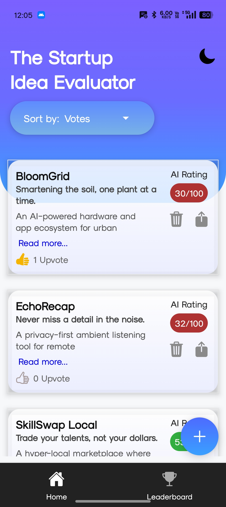
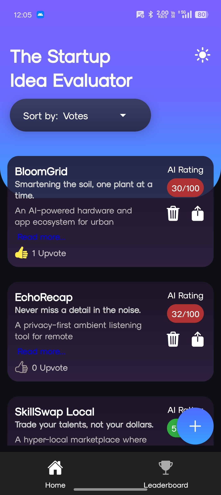
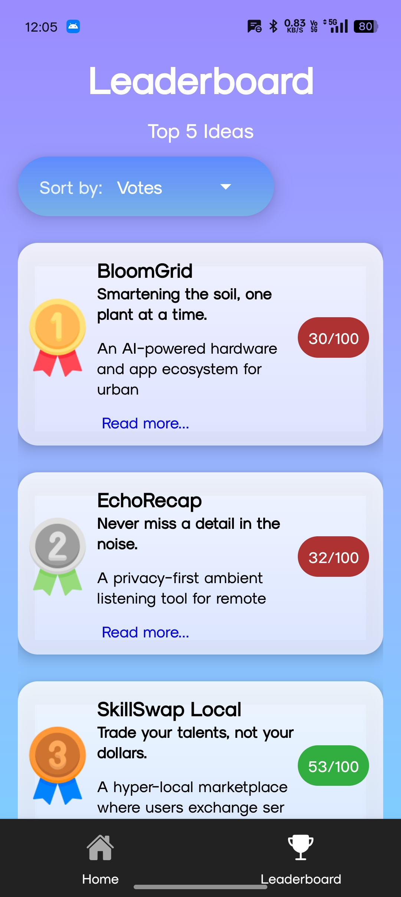
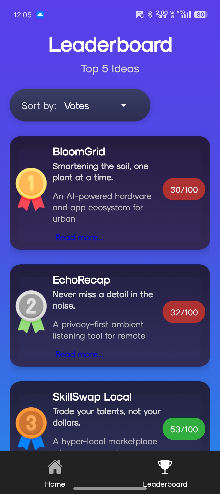
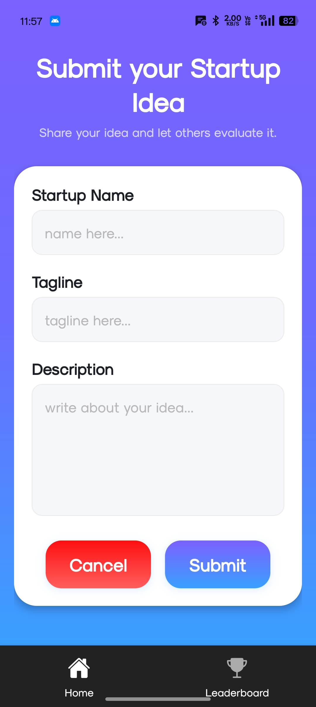
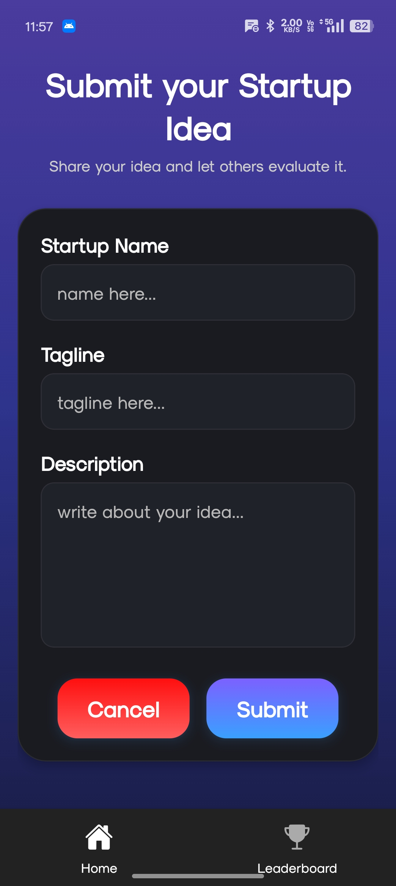

🚀 Startup Idea Evaluator App
A sleek React Native + Expo application that allows users to submit startup ideas, receive an AI-generated score, upvote ideas, and view them on a leaderboard.
Supports Dark/Light Theme, Toast Notifications, Local Storage, and Swipe Navigation.

## 📸 App Screenshots

### 🏠 Home Screen

  
  

### 🏆 Leaderboard

  
  

### 📝 Submit Idea

  
  

📱 Features:

    Submit Startup Ideas

    Add a Startup Name

    Add a Tagline

    Add a Description

    Each idea receives a random AI Rating (0–100)

🏆 Leaderboard:

    Displays all submitted ideas

    Sort by Rating or Upvotes

    Clean card-based UI with gradients

    Read More / Read Less expandable descriptions

    Swipe-enabled tab navigation

👍 Upvote System

    Each idea can be upvoted once

    Saved locally using AsyncStorage

    Updated instantly with animation

🌙 Dark Mode / Light Mode

    Toggle theme globally

    Saves theme preference using AsyncStorage

    Applies gradient + background color changes

    Smooth UI transitions

🔄 Pull-to-Refresh

    Updates leaderboard instantly

    Works with both sort modes

🌐 Local Storage (AsyncStorage)

    Saves:

    All ideas

    Upvote counts

    Theme preference

🎨 UI Technologies Used

    Expo Linear Gradient

    React Native Gesture Handler

    React Navigation Top Tabs

    Ionicons

    Toast Notifications

⚙️ Tech Stack

| Component     | Tech                                 |
| ------------- | ------------------------------------ |
| Framework     | **React Native (Expo)**              |
| Navigation    | **React Navigation**                 |
| Storage       | **AsyncStorage**                     |
| UI            | **LinearGradient, Ionicons**         |
| Notifications | **react-native-toast-notifications** |

🛠️ Installation & Setup
1️⃣ Clone the repository
git clone https://github.com/TeZLa369/Startup.git
cd startup

2️⃣ Install dependencies
npm install

3️⃣ Run the app
expo start
